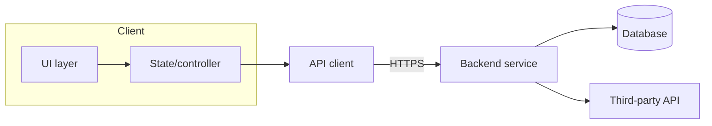

# Phase 3 — Discovery and System Map

**Goal:** understand the system well enough that a finding can be traced to a real
execution path. Skipping this is why audits produce plausible-sounding nonsense.

## 3.1 Read in this order

1. `README`, `docs/`, ADRs, `CONTRIBUTING`, changelog
2. Build and dependency manifests for every component
3. Configuration: env templates, config files, feature flags, secrets *management*
4. Entry points: `main`, app bootstrap, route tables, service definitions, workers,
   scheduled jobs, IPC/handlers, exported components
5. The domain/core layer
6. Data layer: schema, migrations, storage, caching
7. Integration layer: HTTP clients, sockets, SDKs, native bridges
8. Cross-cutting: auth, logging, error handling, telemetry, i18n
9. CI/CD, release, packaging, signing
10. Tests

Under T2/T3, follow the same order but sample step 5–7 by risk and say so.

## 3.2 System map

Produce a Mermaid diagram plus a component table:

Component table columns: name, responsibility, technology (as evidenced),
inbound callers, outbound dependencies, trust boundary crossed, owner-critical
(yes/no).

## 3.3 Critical path inventory

List the flows where a defect actually hurts. Derive from the threat model and
the product's purpose, not from a generic template. Typical members:

- Cold start / bootstrap / migration on upgrade
- Authentication, session lifecycle, logout, token refresh
- Authorization on every privileged operation
- The primary money/data-changing transaction
- Real-time or long-lived connections (WebSocket, streaming, polling, PTT-style channels)
- Background work, offline queue, sync and conflict resolution
- Failure and recovery: network loss, server error, permission revoked, process death
- Anything that touches hardware, actuation, or physical output
- Anything that emits or deletes user data

Each critical path gets: entry point (file:line), the components it traverses,
the state it mutates, and its failure mode.

## 3.4 State machine extraction

For any connection, session, transaction, or device-control state machine, write
out the states, the events, and the transitions **as implemented**, then look for:
unreachable states, missing transitions, transitions that can fire twice,
transitions with no timeout, and states with no exit on error. Desynchronization
between the real state and the state shown in the UI is a recurring high-severity
class — check for a single source of truth.

## 3.5 Technology reality check

Confirm from code, not assumption: concurrency model, DI approach, persistence,
networking stack, UI framework, error-handling convention, logging framework.
Note where two conventions coexist (e.g. callbacks and coroutines, two HTTP
clients) — that inconsistency is itself a maintainability finding.

## Exit gate

- [ ] System map drawn and component table filled
- [ ] Critical paths listed with entry points
- [ ] State machines extracted where they exist
- [ ] Actual technologies confirmed with citations
